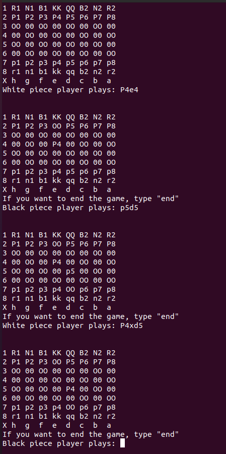

# C Chess Engine

This is a terminal-based chess engine written in the C programming language. The purpose of the project is to implement the full logic of a chess game using only standard C libraries, focusing on modular design, custom data structures, and move validation.

## Features

- Text-based move input (e.g., `P3xc4`, `Nf6`, `Kxe1`)
- Turn-based gameplay for white and black players
- Valid move detection and error handling
- Separation of logic for white and black pieces
- Move parsing with support for capturing (notation using `x`)
- Defensive input validation
- Easily extensible for future improvements such as castling, en passant, and AI

## Project Files

- `chessMain.c` - Main game loop and input handler
- `whitePieces.c/h` - Functions for white piece movement
- `blackPieces.c/h` - Functions for black piece movement
- `additionalFunctions.c/h` - Helper functions such as input checking
- `structures.h` - Shared data structures used across the project
- `Makefile` - Optional makefile for building the project
- `README.md` - Project documentation

## How to Compile and Run

You can compile the program using GCC:

```
gcc -o chess chessMain.c whitePieces.c blackPieces.c additionalFunctions.c
./chess
```

Or use the provided Makefile (if available):

```
make
./chess
```

## Input Format

The engine expects simplified chess move notation:

- `P3xc4` – A pawn from rank 3 captures on c4
- `Rxa7` – A rook captures on a7
- `Nf6` – A knight moves to f6
- Supports both standard moves and captures

## Example Usage

The board is printed after each move. You will be prompted to enter your move in a format similar to `P2e4`. The engine will validate your input, execute the move if valid, and switch turns.

### Board Screenshot

Here is how the board looks in the terminal:



## Planned Improvements
- Basic AI opponent
- Undo/redo functionality
- Check-mate

## License

This project is licensed under the MIT License.

## Author

Developed by a computer engineering student with a focus on embedded systems and low-level C programming.
